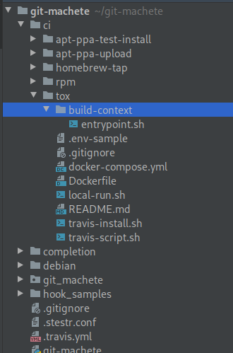
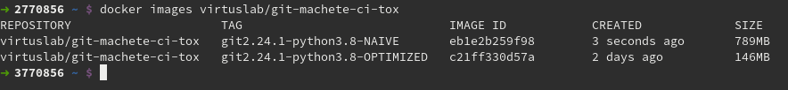

# Nifty Docker tricks for your CI (vol. 1)

If you run dockerized jobs in your CI (or consider migration to the Docker-based flow),
it's very likely that some (if not most) of the techniques outlined in this blog post will prove highly useful to you.

We'll take a closer look at the CI process for an open source tool, [git machete](https://github.com/VirtusLab/git-machete), that is actively developed at VirtusLab.
Having started as a simple tool for rebase automation, it has now grown into a full-fledged Git repository organizer.
It even acquired its own logo, stylized as the original Git logo with extra forks, slashed in half.


The purpose of the git-machete's CI is to ensure that its basic functions work correctly under
a wide array of Git and Python versions that the users might have on their machines.
In this blog post, we're going to create a dockerized environment that allows to run such functional tests both locally and on a CI server.
This particular project uses [Travis CI](https://travis-ci.org/VirtusLab/git-machete), but the entire configuration can be migrated to any other modern CI with minimal effort.

This article assumes that you're familiar with concepts like [Dockerfiles](https://docs.docker.com/engine/reference/builder/)
and [docker-compose](https://docs.docker.com/compose/).


## High-level overview of the setup

Let's start with the project layout (also available [on Github](https://github.com/VirtusLab/git-machete)):



These are the files that are particularly relevant to us:

| File                               | Responsibility                                                       |
| ---                                | ---                                                                  |
| .travis.yml                        | Tells the CI to launch ci/tox/travis-{script,install}.sh             |
| ci/tox/travis-{script,install}.sh  | Runs docker-compose pull/build/push/up commands                      |
| ci/tox/docker-compose.yml          | Provides configuration for building the image/running the container  |
| ci/tox/Dockerfile                  | Stores recipe on how to build the Docker image                       |
| ci/tox/build-context/entrypoint.sh | Serves as the entrypoint for the container                           |


## Reducing image size: keep each layer small

The central part of the entire setup is the [Dockerfile](https://github.com/VirtusLab/git-machete/blob/master/ci/tox/Dockerfile).
Let's first have a look at the part responsible for Git installation:

```dockerfile
ARG git_version
RUN set -x \
    && apk add --no-cache --virtual git-build-deps  alpine-sdk autoconf gettext wget zlib-dev \
    && wget -q https://github.com/git/git/archive/v$git_version.tar.gz \
    && tar xzf v$git_version.tar.gz \
    && rm v$git_version.tar.gz \
    && cd git-$git_version/ \
    && make configure \
    && ./configure \
    && make \
    && make install \
    && cd .. \
    && rm -r git-$git_version/ \
    && git --version \
    && apk del git-build-deps \
    && rm -rfv /usr/local/bin/git-shell /usr/local/share/git-gui/ \
    && cd /usr/local/libexec/git-core/ \
    && rm -fv git-credential-* git-daemon git-fast-import git-http-backend git-imap-send git-remote-testsvn git-shell
```

We'll discuss the parts that have been skipped in the [second part of this post](https://medium.com/virtuslab/TODO) when dealing with non-root user setup.

The purpose of these commands is to install a specific version of Git.
The non-obvious step here is the very long chain of `&&`-ed shell commands under `RUN`, some of which, surprisingly, relate to _removing_ rather than installing software (`apk del`, `rm`).
This prompts two questions: why combine so many commands into a single `RUN` rather than split them into multiple `RUN`s; and why even remove any software at all?

Docker stores the image contents in layers that correspond to Dockerfile instructions.
If an instruction (such as `RUN` or `COPY`) adds data to the underlying file system
(which, by the way, is usually [OverlayFS](https://docs.docker.com/storage/storagedriver/overlayfs-driver/) nowadays),
these data, even if removed in a subsequent layer, will remain part of the intermediate layer that corresponds to the instruction, and will thus make their way to the final image.

If a piece of software (like `alpine-sdk`) is only needed for building the image but not for running the container, then leaving it installed is an utter waste of space.
A reasonable way to prevent the resulting image from bloating
is to remove unnecessary files in the very same layer in which they were added.
Hence, the first `RUN` instruction installs all the compile-time dependencies of Git (`alpine-sdk autoconf gettext wget zlib-dev`),
only to remove them (`apk del`) later in the same shell script.
What remains in the resulting layer is just the Git installation that we care for,
but not the toolchain it was build with (which would be useless in the final image).

A more na&iuml;ve version of this Dockerfile, in which all the dependencies are installed at the very beginning and never removed, yields an almost 800 MB behemoth:



After including the `apk del` and `rm` commands, and squeezing the installations and removals into the same layer,
the resulting image shrinks to around 150-250 MB, depending on the exact versions of Git and Python.
This makes the images caches far less space-consuming.

As a side note, if you're curious how I figured out which files (`git-fast-import`, `git-http-backend` etc.) can be removed from /usr/local/libexec/git-core/,
take a look at [dive](https://github.com/wagoodman/dive), an excellent tool for inspecting files that reside within each layer of a Docker image.


## Making the image reusable: mount a volume instead of `COPY`

It would be very handy if the same image could be used to test multiple versions of the code without having to rebuild the image.
In order to achieve that, the Dockerfile doesn't back the entire project directory into the image with a  `COPY` command (only the entrypoint script is directly copied).
Instead, the codebase is mounted as a volume within the container.
Let's take a closer look at [ci/tox/docker-compose.yml](https://github.com/VirtusLab/git-machete/blob/master/ci/tox/docker-compose.yml),
which provides the recipe on how to configure the image build and how to run the container.

```yaml
version: '3'
services:
  tox:
    image: virtuslab/git-machete-ci-tox:git${GIT_VERSION}-python${PYTHON_VERSION}-${DIRECTORY_HASH}
    build:
      context: build-context
      dockerfile: ../Dockerfile # relative to build-context
      args:
        - user_id=${USER_ID:-0}
        - group_id=${GROUP_ID:-0}
        - git_version=${GIT_VERSION:-0.0.0}
        - python_version=${PYTHON_VERSION:-0.0.0}
    volumes:
      # Host path is relative to current directory, not build-context
      - ../..:/home/ci-user/git-machete
```

We'll return to the `image:` section and explain the origin of `DIRECTORY_HASH` later.

As the `volumes:` section shows, the entire codebase of git-machete is mounted under /home/ci-user/git-machete/ inside the container.
`PYTHON_VERSION` and `GIT_VERSION` variables, which correspond to `python_version` and `git_version` build args,
are provided by Travis based on the configuration in [.travis.yml](https://github.com/VirtusLab/git-machete/blob/master/.travis.yml),
here redacted for brevity:

```yaml
os: linux
language: minimal
env:
  - PYTHON_VERSION=2.7 GIT_VERSION=1.7.10  # Earliest version of git supported by git-machete
  - PYTHON_VERSION=2.7 GIT_VERSION=2.7.6
  - PYTHON_VERSION=3.6 GIT_VERSION=2.20.2
  - PYTHON_VERSION=3.8 GIT_VERSION=2.25.0 DEPLOY_ON_TAGS=true

install: bash ci/tox/travis-install.sh

script: bash ci/tox/travis-script.sh

# ... skipped ...
```

(Yes, we still keep [Python 2 support](https://pythonclock.org/)...
but nevertheless, if you still use Python 2, please upgrade your software!)

The part of the pipeline that actually uses the contents of the mounted volume
is defined in the [ci/tox/build-context/entrypoint.sh](https://github.com/VirtusLab/git-machete/blob/master/ci/tox/build-context/entrypoint.sh) script
that is `COPY`-ed into the image:

```shell script
#!/bin/sh

{ [ -f setup.py ] && grep -q "name='git-machete'" setup.py; } || {
  echo "Error: the repository should be mounted as a volume under $(pwd)"
  exit 1
}

set -e -u -x

$PYTHON -m pip install --user tox
TOXENV="pep8,py${PYTHON_VERSION/./}" tox

$PYTHON setup.py install --user
git machete --version
```

This script first checks if the git-machete repo has really been mounted under the current working directory, then fires
the all-encompassing [`tox`](https://tox.readthedocs.io/en/latest/) command that runs code style check, tests etc.

In the [second part of the series](https://medium.com/virtuslab/TODO), we will cover a technique for caching the images,
as well as a trick to ensure that the files created by the running container inside the volume are not owned by root on the host machine.


------------------------------------------------------------------------------------------------------------------------------------
------------------------------------------------------------------------------------------------------------------------------------
------------------------------------------------------------------------------------------------------------------------------------

# Nifty Docker tricks for your CI (vol. 2)

The [first part of the series](https://medium.com/virtuslab/TODO) outlined the techniques for reducing the image size,
as well as avoiding the need to rebuild the image every time when the codebase changes.
Let's continue with further Docker-related CI tricks, as showcased in [git-machete](http://github.com/VirtusLab/git-machete)'s Travis CI setup.

## Caching the images: make use of Docker tags

It would be nice to cache the generated images, so that CI doesn't build the same stuff over and over again.
By the way, the purpose of the extreme image size optimization outlined [in the previous part](https://medium.com/virtuslab/TODO) is also to facilitate caching.

Think for a moment what exactly causes one generated image to be different from another.
We obviously have to take into account the versions of Git and Python &mdash; passing different combinations of these will surely result in a different final image.
Therefore, the Docker image tag should include the information about these versions in order to make the caching possible.

But with respect to the project files... since it's ci/tox/build-context that's passed as build context,
the Dockerfile doesn't know anything about the files from outside that directory!
This means that even though other files change as the project is being developed,
we could theoretically use the same image if ci/tox/build-context remains untouched.
Note that the build context usually changes very rarely compared to the actual source files.

There's a catch here, though.
The build context is not the only thing that can affect the final Docker image.
A change to the Dockerfile itself can obviously lead to a different result,
but modification to docker-compose.yml and even the scripts that run `docker-compose` may also influence the result e.g. by changing environment variables and/or values passed as arguments.
But since all those files reside under ci/tox/, this doesn't make things much worse &mdash;
the entire resulting build image depends only on the contents of ci/tox/ directory instead of ci/tox/build-context/
(with one exception that packages installed via apt-get can also get updated over time in their respective APT repositories).

Therefore, the image can be uniquely identified by the hash of its ci/tox/ directory.
We don't even need to derive that hash manually, because git computes a SHA-1 hash for each object it stores.
It's a well known fact that every commit has a unique hash, but actually SHA-1 hashes are also derived for each file (called a _blob_ in gitspeak) and each directory (called a _tree_).
The hash of a tree is based on the hashes of all of its nested blobs and subtrees.
More details can be found in [this slide deck on git internals (aka "git's guts")](https://slides.com/plipski/git-internals/).
For our use case, it means that any change to the files inside ci/tox/ will yield a new Docker image tag.

To get the hash of a given directory within the current commit (HEAD),
we can resort to a plumbing command called `rev-parse`:

```shell script
git rev-parse HEAD:ci/tox
```

The argument has the form `<revision>:<path>`, same as in `git show`.

Note that this hash is not the same as the hash of the resulting Docker image.
Also, git object hashes are 160-bit (40 hex digit) SHA-1 hashes, while Docker identifies images by their 256-bit (64 hex digit) SHA-256 hash.

Back into [ci/tox/docker-compose.yml](https://github.com/VirtusLab/git-machete/blob/master/ci/tox/docker-compose.yml) for a moment:

```yaml
version: '3'
services:
  tox:
    image: virtuslab/git-machete-ci-tox:git${GIT_VERSION}-python${PYTHON_VERSION}-${DIRECTORY_HASH}
# ... skipped ...
```

We already know that `GIT_VERSION` and `PYTHON_VERSION` are set up directly by Travis based on values specified in .travis.yml.
Let's peek into [ci/tox/travis-install.sh](https://github.com/VirtusLab/git-machete/blob/master/ci/tox/travis-install.sh) to see where `DIRECTORY_HASH` comes from:

```shell script
# ... skipped ...

DIRECTORY_HASH=$(git rev-parse HEAD:ci/tox)
export DIRECTORY_HASH
cd ci/tox/

# If there is no cached image for the expected Git&Python versions and the current state of ci/tox,
# build the image and push it to the Docker Hub.
docker-compose pull tox || {
  docker-compose build --build-arg user_id="$(id -u)" --build-arg group_id="$(id -g)" tox
  # In builds coming from forks, secret vars are unavailable for security reasons; hence, we have to skip pushing the newly built image.
  if [[ ${DOCKER_PASSWORD-} && ${DOCKER_USERNAME-} ]]; then
    echo "$DOCKER_PASSWORD" | docker login -u "$DOCKER_USERNAME" --password-stdin
    docker-compose push tox
  fi
}
```

Once we've got the directory hash, first of all we check (`docker-compose pull`) whether the image with the given tag is already present
in the [virtuslab/git-machete-ci-tox repository on Docker Hub](https://hub.docker.com/r/virtuslab/git-machete-ci-tox/tags).

If there is no previous build for the given combination of Git version, Python version and contents of ci/tox directory,
`docker-compose pull` would return a non-zero exit code, although this can also mean a failure of the pull operation.
In either case, we need to construct the image from scratch.

Note that `docker-compose build` accepts additional arguments, namely `user_id ` and `group_id`; we'll explain their purpose in the next section.

Once the image is built, we log in to Docker Hub and perform a `docker-compose push`.
A little catch here: Travis completely forbids the use of secret variables in builds that are triggered by forks.
Even though Travis masks the _exact matches_ of a secret value in build logs, it can't prevent a malicious "contributor" from printing e.g. base64-encoded
(or otherwise reversibly transformed) secret, which would constitute an obvious security breach.
Thus, we need to make sure that the Docker credentials are indeed available in the environment; if that's not the case, we refrain from pushing the image.

It is not strictly necessary to user `docker-compose`, but this saves us from specifying the same parameters over and over again.
If we were to use just plain `docker pull/build/push` instead of their `docker-compose` counterparts,
we'd need to supply e.g. the image name and tag every single time.

Once we have the image in place (either pulled from Docker Hub or built from scratch),
running the tests is easy, see [ci/tox/travis-script.sh](https://github.com/VirtusLab/git-machete/blob/master/ci/tox/travis-script.sh):

```shell script
# ... skipped ...

docker-compose up --exit-code-from=tox tox
```

The `--exit-code-from=` option of `docker-compose up` is relatively unknown, yet it's crucial in automated workflows.
By default, `docker-compose up` returns zero regardless of the exit codes returned by the services it launched.
This leads to false success reports in CI pipelines even when `tox` (and thus the entire entrypoint script) fails.
We have to explicitly pick the service whose exit code will become the exit code for the entire `docker-compose up` command.
The likely reason behind this behaviour is the fact that the `up` command can run more than one service (especially when the `depends_on` mechanism is involved).
In such cases it is not clear which service should provide the exit code for the entire command.


## Running the build locally: configure a non-root user

To run the tests locally:

```shell script
cd ci/tox
cp .env-sample .env  # and optionally edit if needed to change git/python version
./local-run.sh
```

[ci/tox/local-run.sh](https://github.com/VirtusLab/git-machete/blob/master/ci/tox/local-run.sh) is somewhat similar to how things are run on Travis:

```shell script
# ... skipped ...

function build_image() {
  docker-compose build --build-arg user_id="$(id -u)" --build-arg group_id="$(id -g)" tox
}

cd "$(git rev-parse --show-toplevel)"/ci/tox/
check_var GIT_VERSION
check_var PYTHON_VERSION

set -x

hash=$(git rev-parse HEAD:ci/tox)
if git diff-index --quiet HEAD .; then
  DIRECTORY_HASH=$(git rev-parse HEAD:ci/tox)
  export DIRECTORY_HASH="$hash"
  docker-compose pull tox || build_image
else
  export DIRECTORY_HASH="$hash"-dirty
  build_image
fi

docker-compose up --exit-code-from=tox tox
```

The difference is just additional sanity checks like whether variables are defined (`check_var`) and whether there are any uncommitted changes (`git diff-index`).
Also, we don't attempt to push the freshly-built image to the Docker Hub since we can rely on a local build cache instead.

Our entire setup assumes that the git-machete directory from the host is mounted as a volume inside the Docker container
(as described in detail in [part 1](https://medium.com/virtuslab/TODO)).
Every command in the Docker container is by default executed with root user privileges.
As a consequence, any new file that the container creates inside the mounted volume will be owned by root not only in the container... but also on the host!
This leads to a very annoying experience: all the files that are usually generated by the build (like build/ and dist/ directories in case of Python, or target/ for JVM tools)
will belong to root.


If only Docker had an option to run commands as a non-root user...

Let's take a look at [ci/tox/Dockerfile](https://github.com/VirtusLab/git-machete/blob/master/ci/tox/Dockerfile) again, this time at the bottom part:
```dockerfile
# ... git & python setup - skipped ...

ARG user_id
ARG group_id
RUN set -x \
    && [ ${user_id:-0} -ne 0 ] \
    && [ ${group_id:-0} -ne 0 ] \
    && addgroup --gid=${group_id} ci-user \
    && adduser --uid=${user_id} --ingroup=ci-user --disabled-password ci-user
USER ci-user
ENV PATH=$PATH:/home/ci-user/.local/bin/
COPY --chown=ci-user:ci-user entrypoint.sh /home/ci-user/
RUN chmod +x ~/entrypoint.sh
CMD ["/home/ci-user/entrypoint.sh"]
WORKDIR /home/ci-user/git-machete
```

The trick is to create a new user with the same user and group ID as your user on the host.
This is accomplished by the `function build_image` in ci/tox/local-run.sh:
`docker-compose build --build-arg user_id="$(id -u)" --build-arg group_id="$(id -g)" tox`.
If you use any modern Linux distribution and have just one non-root user on your machine, they're both likely equal to 1000 (see `UID_MIN` and `GID_MIN` in /etc/login.defs);
on Travis VMs they both turn out to be 2000.

We switch from `root` to the newly-created user by calling `USER ci-user`.

Using rather unusual syntax (Unix-style `--something` options are rarely passed directly to a Dockerfile instruction), we need to specify `--chown` flag for `COPY`.
Otherwise, the files would end up owned by `root:root`.
The preceding `USER` instruction, unfortunately, doesn't affect the default owner of `COPY`-ed (or `ADD`-ed, for that matter) files.

The fact that the files created by `ci-user` within the container also belong to an existing user in the host system may seem confusing.
Where does this correspondence come from, especially if the host doesn't have a user or group named `ci-user`?

Well, actually it's the numeric ID of user/group that matters.
User names on Unix systems are just aliases, and the same user ID may have different names assigned on the host system and inside the container.
As a consequence, even if there was indeed a user called `ci-user` on the host machine,
that still completely wouldn't matter from the perspective of ownership of files generated within a container &mdash;
still, the only thing that matters is the numeric ID.

After launching `./local-run.sh` we can see that all files generated inside the volume are owned by the current host user:


## Next steps

We advise to also get familiar with an alternative technique for reducing image size called
[multistage builds](https://docs.docker.com/develop/develop-images/multistage-build/).
It was not a viable option for our use case, however, since Git installs files into multiple locations across the file system.

More details on the git-machete tool itself can be found in the usage guide:
[part 1 (basic usage)](https://medium.com/virtuslab/make-your-way-through-the-git-rebase-jungle-with-git-machete-e2ed4dbacd02)
and [part 2 (advanced features)](https://medium.com/virtuslab/git-machete-strikes-again-traverse-the-git-rebase-jungle-even-faster-with-v2-0-f43ebaf8abb0).

Contributions (and stars on Github) are more than welcome!
