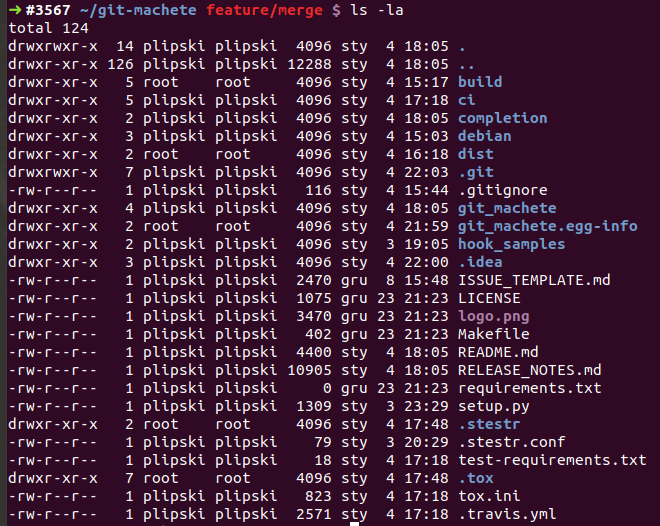
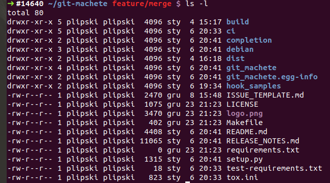

# Nifty Docker tricks you'll crave to use in your CI!

If you're running dockerized jobs in your CI (or considering migration to Docker-based flow),
it's very likely that some (if not most) of the techniques outlined in this blog post will prove very useful to your team.

We'll take a closer look at the CI process for an open source tool being under active developed at VirtusLab.
[git machete](https://github.com/VirtusLab/git-machete), having started as simple rebase automation tool,
now developed into a full-fledged git repository organizer and even earned its own logo, stylized as git cut in the half.


The purpose of the git-machete's CI is to ensure that it performs its basic functions correctly under
a wide array of git and Python versions that the users might have on their machines.

Let's create a Dockerized environment that allows for running such tests both locally and on a CI.
We're using [Travis CI](https://travis-ci.org/VirtusLab/git-machete) specifically, but the effort needed to migrate the entire configuration to any other modern CI is minimal.

It's assumed you're familiar with concepts like [Dockerfiles](https://docs.docker.com/engine/reference/builder/)
and [docker-compose](https://docs.docker.com/compose/).


## The five-layered stack

Let's get this handy table first:

| File                               | Responsibility                                                       |
| ---                                | ---                                                                  |
| .travis.yml                        | Tells the CI to launch ci/tox/travis-{script,install}.sh             |
| ci/tox/travis-{script,install}.sh  | Runs docker-compose pull/build/push/up commands                      |
| ci/tox/docker-compose.yml          | Provides configuration for building the image/running the container  |
| ci/tox/Dockerfile                  | Stores recipe on how to build the Docker image                       |
| ci/tox/build-context/entrypoint.sh | Serves as the entrypoint for the container                           |

As often the case with similar stack-like solutions, the layers are organized so that no layer needs to know anything about the ones above,
only about the ones below (in fact, typically just one below and not more).


## Reducing image size: keep each layer small

Arguably, the most central part of the entire setup is the [Dockerfile](https://github.com/VirtusLab/git-machete/blob/chore/ci-multiple-git-versions/ci/tox/Dockerfile).

```dockerfile
FROM ubuntu:18.04

ARG git_version
RUN set -x \
    && apt-get update \
    && apt-get install -y autoconf gcc gettext libz-dev make unzip wget \
    && wget -q https://github.com/git/git/archive/v$git_version.zip \
    && unzip -q v$git_version.zip \
    && rm v$git_version.zip \
    && cd git-$git_version \
    && make configure \
    && ./configure \
    && make \
    && make install \
    && git --version \
    && cd .. \
    && rm -rf git-$git_version/ \
    && apt-get purge -y autoconf gcc gettext libz-dev make unzip wget \
    && apt-get autoremove -y \
    && rm -rf /var/lib/apt/lists/*

ARG python_version
ENV PYTHON_VERSION=${python_version}
ENV PYTHON="python${python_version}"
RUN set -x \
    && apt-get update \
    && apt-get install -y --no-install-recommends software-properties-common \
    && add-apt-repository ppa:deadsnakes/ppa \
    && apt-get update \
    && apt-get purge -y software-properties-common \
    && apt-get autoremove -y \
    && PYTHON_MAJOR=${python_version%.*} \
    && if [ "$PYTHON_MAJOR" -eq 2 ]; then apt-get install -y --no-install-recommends gcc ${PYTHON}-dev python-pip; fi \
    && if [ "$PYTHON_MAJOR" -eq 3 ]; then apt-get install -y --no-install-recommends python3-pip; fi \
    && apt-get install -y --no-install-recommends $PYTHON \
    && $PYTHON -m pip install setuptools six wheel \
    && $PYTHON -m pip install tox \
    && rm -rf /var/lib/apt/lists/*

ARG user_id
ARG group_id
RUN "[" ${user_id:-0} -ne 0 ] \
    && [ ${group_id:-0} -ne 0 ] \
    && groupadd -g ${group_id} ci-user \
    && useradd -l -u ${user_id} -g ci-user ci-user \
    && install -d -m 0755 -o ci-user -g ci-user /home/ci-user
USER ci-user
COPY --chown=ci-user:ci-user entrypoint.sh /home/ci-user/
RUN chmod +x ~/entrypoint.sh
CMD ["/home/ci-user/entrypoint.sh"]
WORKDIR /home/ci-user/git-machete
```

Let's leave the third section (the one with `user_id` and `group_id` ARGs) aside for a moment, we'll come back there later.

The purpose of the first two sections is to set up git and Python in the desired versions.
The non-obvious piece here are very long chains of `&&`-ed shell commands under `RUN`, some of which, surprisingly, relate to _removing_ rather than installing software
(`apt-get purge`, `apt-get autoremove`, `rm -rf`).
Two questions arise: why combine so many commands into a single `RUN` rather than split them into mutliple `RUN`s and why remove any software at all?

Docker stores data in layers that correspond to Dockerfile instructions.
If an instruction (typically `RUN` or `COPY`) adds data to the underlying file system (which is typically OverlayFS on modern systems, by the way),
this data, even if it's later removed in a subsequent layer, will remain a part of the layer and thus of the resulting image.
If some software is only needed for building the image but not for running the container, then leaving it installed is a pure waste of space.
The only way to prevent the resulting image from bloating is to remove no longer necessary files in the very same layer as they were added.
Hence, the first `RUN` instruction installs all of `autoconf gcc gettext libz-dev make unzip wget`, necessary to build git from source, only to later remove it in the same shell script.
What survives in the resulting layer is only the git installation that we care for, but not the GNU toolchain necessary to arrive at this installation in the first place
(but otherwise useless in the final image).

A more naive version of this Dockerfile, with all the dependencies installed at the very beginning and never removed, yields an almost 1GB behemoth.
After including the `apt-get purge` and `apt-get autoremove` commands, and squeezing the installations and removals into the same layer,
the resulting image shrank to around 250-300MB, depending on the exact git and Python version.
This will make caching the images (covered in one of the next chapters) far less space-consuming.


## Making the image reusable: mount project folder as a volume

Now let's note that Dockerfile doesn't refer to any portion of the project's codebase other than to entrypoint.sh.
The trick is that the entire codebase is mounted as a volume to the _container_ rather than baked into the image!
Let's take a closer look at [ci/tox/docker-compose.yml](https://github.com/VirtusLab/git-machete/blob/chore/ci-multiple-git-versions/ci/tox/docker-compose.yml)
which provides the recipe on how to configure the image build and how to run the container.
By the way, since the YAML itself is located in ci/tox/, the assumption is that `${PWD}` points to ci/tox/ rather than to the project root.

```yaml
version: '3'
services:
  tox:
    image: virtuslab/git-machete-ci-tox:${DOCKER_TAG:-latest}
    build:
      context: build-context
      dockerfile: ${PWD}/Dockerfile
      args:
        - user_id=${USER_ID:-0}
        - group_id=${GROUP_ID:-0}
        - git_version=${GIT_VERSION:-0.0.0}
        - python_version=${PYTHON_VERSION:-0.0.0}
    volumes:
      - ${PWD}/../..:/home/ci-user/git-machete
```

Let's skip the `image:` section and where `DOCKER_TAG` comes from for a moment, we'll delve into that later.

As `volumes:` section indicates, the entire git-machete codebase is mounted under `WORKDIR` (/home/ci-user/git-machete/) inside the container.
`PYTHON_VERSION` and `GIT_VERSION` variables, which correspond to `python_version` and `git_version` build args,
are provided by Travis based on the configuration in [.travis.yml](https://github.com/VirtusLab/git-machete/blob/chore/ci-multiple-git-versions/.travis.yml),
here redacted for brevity:

```yaml
os: linux
language: minimal
env:
  - PYTHON_VERSION=2.7 GIT_VERSION=2.0.0
  - PYTHON_VERSION=2.7 GIT_VERSION=2.7.1
  - PYTHON_VERSION=3.6 GIT_VERSION=2.20.1
  - PYTHON_VERSION=3.8 GIT_VERSION=2.24.1 DEPLOY_ON_TAGS=true

install: bash ci/tox/travis-install.sh

script: bash ci/tox/travis-script.sh

# ... skipped ...
```

(Yes, we're still keeping [Python 2 support](https://pythonclock.org/)...
but in general, if you still somehow happen to have Python 2 (and not 3) on your machine, please upgrade your software!)

The part of the pipeline that actually takes the contents of the mounted volume into account
is located in [ci/tox/build-context/entrypoint.sh](https://github.com/VirtusLab/git-machete/blob/chore/ci-multiple-git-versions/ci/tox/build-context/entrypoint.sh) script:

```shell script
#!/usr/bin/env bash

{ [[ -f setup.py ]] && grep -q "name='git-machete'" setup.py; } || {
  echo "Error: the repository should be mounted as a volume under $(pwd)"
  exit 1
}

set -e -u -x

TOXENV="pep8,py${PYTHON_VERSION/./}" tox
$PYTHON setup.py install --user
PATH=$PATH:~/.local/bin/
git machete --version
```

It's first checking if the git-machete repo has really been mounted under current working directory, an subsequently fires
the all-encompassing [`tox`](https://tox.readthedocs.io/en/latest/) command that runs code style check, tests etc.


## Caching the images: make use of Docker tags

It would be nice to cache the generated images, so that CI doesn't need to build the same image over and over again.
That caching was by the way also the purpose of the intense image size optimization outlined previously.

Let's think for a moment what specifically makes one generated image different from another.
We obviously have to take into account git and Python version - passing a different combination of those will surely result in a different final image.
Those versions definitely need to be included in the Docker image tag to make the caching possible.

But with respect to project files... since it's ci/tox/build-context that's passed as build context, Dockerfile doesn't know anything about the files from outside ci/tox/build-context!
This means that even if other files change (which is, well, inevitable when the project is being developed), we could theoretically use the same image as long as ci/tox/build-context remains untouched.
Note that the changes to ci/tox/build-context are likely to be very rare compared to how often the rest of codebase is going to change.

There's a catch here, though.
Build context is not the only think that can affect the final Docker image -
Dockerfile, docker-compose.yml and even the scripts that run `docker-compose` can also influence the result.
But since all those files reside under ci/tox/, this doesn't make things much worse - the entire resulting build image depends only on the contents of ci/tox/ directory
(with one reservation that packages installed via apt-get can also get updated over time in their respective APT repositories).

Given all that, what if we just computed the hash of the entire ci/tox/ directory and used it to identify the image?
Actually, we don't even need to compute that hash ourselves!
We can take advantage of SHA-1 hashes that git computes for each object.
It's a well known fact that each commit in git has a unique hash, but actually SHA-1 hashes are also derived for each file (called a _blob_ in gitspeak) and each directory (called a _tree_).
Hash of a tree is a function of hashes of all its underlying blobs and, recursively, trees.
More details can be found in [this slide deck on git internals (aka "git's guts")](https://slides.com/plipski/git-internals/).
For our use case it means that once any file inside ci/tox/ changes, we'll end up with a different Docker image tag.

To extract the hash of given directory within the current commit (HEAD),
we need to resort to one of the more powerful and versatile _plumbing_ commands of git called `rev-parse`:

```shell script
git rev-parse HEAD:ci/tox
```

The `<revision>:<path>` syntax might be familiar from `git show`.

Note that obviously this hash is completely distinct from the resulting Docker image hash.
Also, git object hashes are 160-bit (40 hex digit) SHA-1 hashes, while Docker identifies images by their 256-bit (64 hex digit) SHA-256 hash.

Let's now peek into [ci/tox/travis-install.sh](https://github.com/VirtusLab/git-machete/blob/chore/ci-multiple-git-versions/ci/tox/travis-install.sh):

```shell script
# ... skipped ...

DOCKER_TAG=git${GIT_VERSION}-python${PYTHON_VERSION}-$(git rev-parse HEAD:ci/tox)
export DOCKER_TAG
cd ci/tox

# If the image corresponding to the expected git&python versions and the current state of ci/tox is missing, build it and push to Docker Hub.
docker-compose pull tox || {
  docker-compose build --build-arg user_id="$(id -u)" --build-arg group_id="$(id -g)" tox
  # In builds coming from forks, secret vars are unavailable for security reasons; hence, we have to skip pushing the newly built image.
  [[ -n ${DOCKER_PASSWORD-} && -n ${DOCKER_USERNAME-} ]] && {
    echo "$DOCKER_PASSWORD" | docker login -u "$DOCKER_USERNAME" --password-stdin
    docker-compose push tox
  }
}
```

We cook up the `DOCKER_TAG` (remember? it's referenced under `image` in docker-compose.yml!)
from the 3 variables that we need to take into account: git version, Python version and git hash of ci/tox directory.

Now the first thing that happens is that we check (`docker-compose pull`) whether the image with the given tag already present
in the [virtuslab/git-machete-ci-tox repository on Docker Hub](https://hub.docker.com/r/virtuslab/git-machete-ci-tox/tags).

If `docker-compose pull` returns a non-zero exit code, then it means no build so far has been executed for the given combination of
git version, Python version and contents of ci/tox directory - we need to construct it now from scratch.

Note that `docker-compose build` accepts `user_id ` and `group_id` build arguments... we'll delve into that in the next section.

Later we log in to Docker Hub and push the image.
A little catch here - Travis completely forbids the use of secret variables in builds coming from forks.
Even though Travis masks the _exact matches_ of a secret value in build logs, it can't prevent a malicious "contributor" from printing e.g. base64-encoded
(or otherwise reversibly transformed) secret, which would constitute an obvious security breach.
Thus, we need to make sure that the Docker credentials are indeed available in the environment; otherwise, we refrain from pushing the image.

Note that using `docker-compose`, although not strictly necessary for our use case, saves us from specifying the same parameters over and over again.
If we were to use just plain `docker pull/build/push` instead of their `docker-compose` counterparts,
we'd need to supply e.g. the image name and tag every single time.

Once we have the image in place (either just being built or, hopefully, pulled from Docker Hub),
running the tests is easy, see [ci/tox/travis-script.sh](https://github.com/VirtusLab/git-machete/blob/chore/ci-multiple-git-versions/ci/tox/travis-script.sh):

```shell script
# ... skipped ...

docker-compose up --exit-code-from=tox tox
```

The `--exit-code-from=` option to `docker-compose up` is relatively unknown, yet crucial in automated workflows.
By default, `docker-compose up` does not return the exit code of any of the launched services, just zero (assuming it launched all the services successfully).
This would lead to CI pipelines falsely passing even when `tox` (and thus the entire entrypoint script) fails.
We have to explicitly pick the service whose exit code should serve as the exit code of the entire `docker-compose up` command.
One of the likely rationales for that option not being the default is that `up` can run more than one service at once (esp. when `depends_on` mechanism is involved)
and it wouldn't be obvious the exit code of which service should be selected.


## Running the build locally: provide a non-root user

To run the tests locally:

```shell script
cd ci/tox
cp .env-sample .env
docker-compose up --build --exit-code-from=tox tox
```

Here we don't even need to resort to an external registry like Docker Hub, we can just rely on local Docker cache to remember the already constructed layers.

As you remember from the previous sections, our entire setup assumes that git-machete directory from the host is mounted as a volume inside the Docker container.
The problem is that unless explicitly told otherwise, every command in Docker container is executed with root user privileges.
By default any file that might be created by the container inside a volume will be owned by root not only in the container... but also in the host!
This leads to a very annoying experience - all the files that are usually generated by the build (like `build/` and `dist/` directories in case of Python, or `target/` for JVM tools)
will belong to root:



If only Docker provided the option to run commands as a non-root user...

Let's take a look again at [ci/tox/Dockerfile](https://github.com/VirtusLab/git-machete/blob/chore/ci-multiple-git-versions/ci/tox/Dockerfile), this time the bottom part:
```dockerfile
# ... git & python installation - skipped ...

ARG user_id
ARG group_id
RUN "[" ${user_id:-0} -ne 0 ] \
    && [ ${group_id:-0} -ne 0 ] \
    && groupadd -g ${group_id} ci-user \
    && useradd -l -u ${user_id} -g ci-user ci-user \
    && install -d -m 0755 -o ci-user -g ci-user /home/ci-user
USER ci-user
COPY --chown=ci-user:ci-user entrypoint.sh /home/ci-user/
RUN chmod +x ~/entrypoint.sh
CMD ["/home/ci-user/entrypoint.sh"]
WORKDIR /home/ci-user/git-machete
```

We first run `groupadd` and `useradd` to create the user.
Home folder is created with a single invocation of `install`, a very convenient and surprisingly obscure GNU utility
that combines some of the most commonly used features of `cp`, `mkdir`, `chmod` and `chown`.
A single `install` invocation creates the home folder and ensures proper ownership and access modes.

Now the entire trick is to fill up the `user_id` and `group_id` ARGs with user and group id of the your user on your machine.
On modern Linuxes, it's likely 1000 (see `UID_MIN` and `GID_MIN` in /etc/login.defs) if you have just one user on your machine.
CI is no special case - we'd fill those arguments with the CI user/group id, whatever it might be (for Travis they actually both turn out to be 2000).

Setting the ARGs themselves, however, is approached slightly differently for local builds (using .env file that hard-codes the ids into environment variables, see [ci/tox/.env-sample](https://github.com/VirtusLab/git-machete/blob/chore/ci-multiple-git-versions/ci/tox/.env-sample))
and on CI (where we explicitly pass the result of Unix command `id -u` as `user_id` and the result of `id -g` as `group_id` in `docker-compose build`, see [ci/tox/travis-install.sh](https://github.com/VirtusLab/git-machete/blob/chore/ci-multiple-git-versions/ci/tox/travis-install.sh)).

Now we switch away from `root` to the newly-created user by calling `USER ci-user`.

With a rather unusual syntax (we rarely see Unix-style `--something` options accepted directly by a Dockerfile instruction), we need to pass `--chown` flag to `COPY`.
Otherwise, the files would end up owned by `root:root`.
The preceding `USER` instruction unfortunately doesn't affect the default owner of `COPY`-ed (or `ADD`-ed, for that matter) files.

One can now ask... well, how come `ci-user` from inside the container can be in any way equivalent to an existing user on the host machine (esp. given that host most likely doesn't have a `ci-user` user or group)?

Well, actually it's the numeric id of user/group that matters; names on Unix systems are just aliases, and they can resolve differently on the host machine and inside the container.
As a consequence, if there was indeed user called `ci-user` on the host machine... that still completely wouldn't matter from the perspective of ownership of files generated within container -
still, the only thing that matters is the numeric id.

Now after launching `docker-compose up --build tox` we can observe that all files generated inside the volume are owned by the currently logged-in host user:




## Summary: where to look next

We've taken a look at the entire stack used for building and testing git branches,
but there is also a similar setting for deployment (only executed for git tags) in [ci/apt-ppa](https://github.com/VirtusLab/git-machete/tree/chore/ci-multiple-git-versions/ci/apt-ppa-upload) directory,
specifically for upload of Debian packages to [PPA (Personal Package Archive) for Ubuntu](https://launchpad.net/~virtuslab/+archive/ubuntu/git-machete/+packages).
From the technical perspective, the only significantly different point is more prevalent use of secrets (for GPG and SSH).

For more details on git-machete tool itself, see
[first part of a guide on how to use the tool](https://medium.com/virtuslab/make-your-way-through-the-git-rebase-jungle-with-git-machete-e2ed4dbacd02) and
[second part for the more advanced features](https://medium.com/virtuslab/git-machete-strikes-again-traverse-the-git-rebase-jungle-even-faster-with-v2-0-f43ebaf8abb0).

Contributions (and stars on Github!) are more then welcome, especially if you're proficient with production use of Python or with the internals of git.
